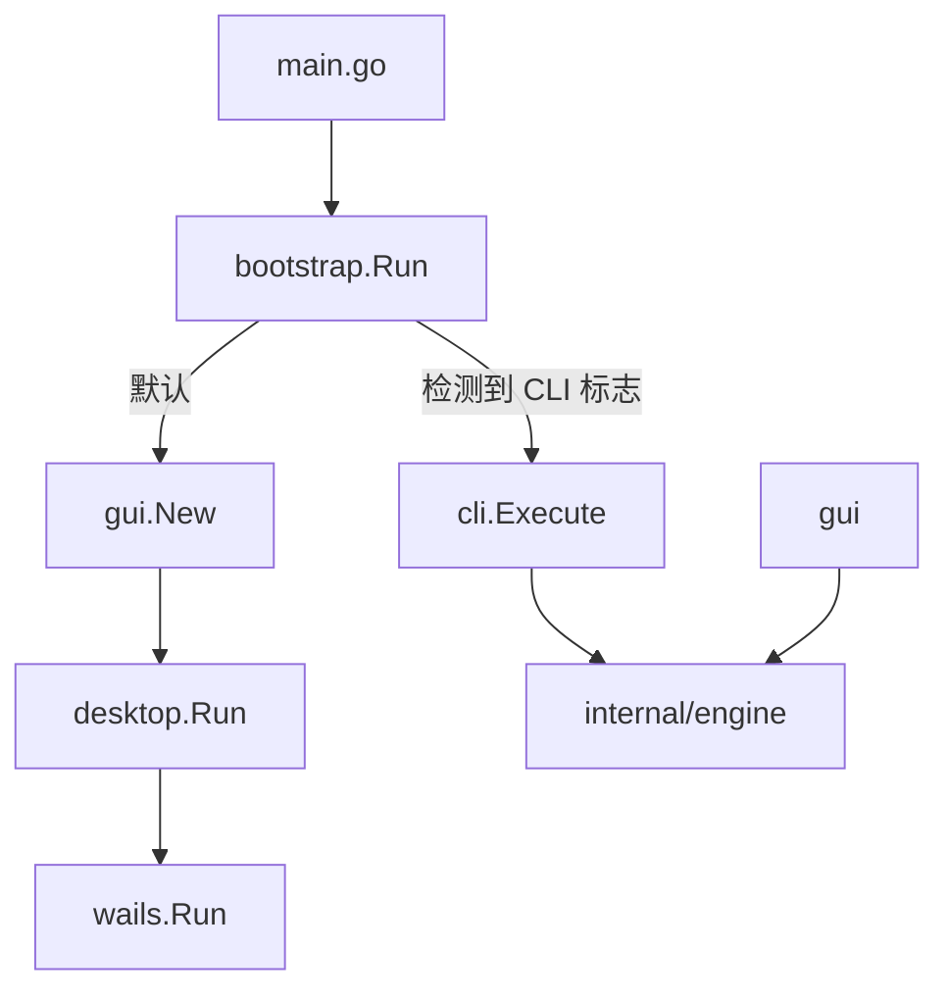

# Videopress 架构说明

## 目录结构

```text
videopress/
├── main.go                 # 极简入口，调用 bootstrap.Run
├── wails.json              # Wails 项目配置（须与 main 同处根目录）
├── frontend/               # Svelte 前端 + embed 静态资源
│   ├── embed.go            # //go:embed all:dist
│   ├── src/                # 前端源码
│   └── wailsjs/go/gui/     # Wails 自动生成的 Go↔JS 绑定
├── internal/
│   ├── bootstrap/          # CLI/GUI 模式分发
│   ├── cli/                # 命令行入口与参数解析
│   ├── gui/                # Wails GUI 方法绑定
│   ├── desktop/            # wails.Run 窗口配置
│   ├── locale/             # 系统 UI 语言检测
│   ├── engine/             # 压缩调度
│   ├── ffmpeg/             # FFmpeg 探测与命令
│   ├── compress/           # 预设与路径
│   ├── env/                # Path 环境变量
│   ├── notify/             # 系统通知
│   ├── sendto/             # 右键集成
│   └── util/               # 工具函数
├── docs/
│   ├── ARCHITECTURE.md     # 本文件
│   └── DESIGN.md           # 视觉设计契约
└── build/bin/              # wails build 产物（唯一发布路径）
```

## 启动流程



## 为何 main.go 留在根目录

Wails v2 CLI 假定 **main 包与 wails.json 同在仓库根目录**。将入口迁到 `cmd/videopress/` 需额外路径 hack，维护成本高。当前策略：根目录仅保留极简 `main.go`，业务逻辑全部在 `internal/`。

## 前端绑定

- Go 侧绑定结构：`internal/gui.App`
- 生成路径：`frontend/wailsjs/go/gui/App.js`
- 前端 import 示例：`import { StartCompress } from '../wailsjs/go/gui/App.js'`

修改 `internal/gui/app.go` 中导出方法后，需运行 `wails build` 或 `wails generate module` 重新生成绑定。

## 静态资源嵌入

前端构建产物 `frontend/dist/` 由 [`frontend/embed.go`](../frontend/embed.go) 嵌入，`internal/desktop` 通过 `frontend.Dist` 提供给 Wails AssetServer。

**硬约束**：`frontend/dist` 在 `.gitignore` 中，任何 Go 命令（`go test`、`go build`、`wails generate module`）都依赖它已存在。不要直接裸跑 `go test ./...`，使用下方构建入口。

## 构建命令

统一入口为 [`scripts/make.ps1`](../scripts/make.ps1)（Windows 推荐）或 [`Makefile`](../Makefile)（需安装 `make`）：

```powershell
# 本地测试（自动先构建 frontend/dist）
pwsh -File scripts/make.ps1 test

# 完整 GUI 发布构建
pwsh -File scripts/make.ps1 build
# 产物：build/bin/videopress.exe

# 与 CI 相同的全量检查
pwsh -File scripts/make.ps1 ci
```

```bash
# 有 make 时等价
make test
make build
make ci
```

仅当已手动构建过 `frontend/dist` 时，才可裸跑 `go test ./...`。

## 版本注入

Release 构建通过 ldflags 注入：

```text
-X videopress/internal/cli.Version=<version>
```

默认版本定义在 [`internal/cli/app.go`](../internal/cli/app.go) 的 `Version` 变量。
